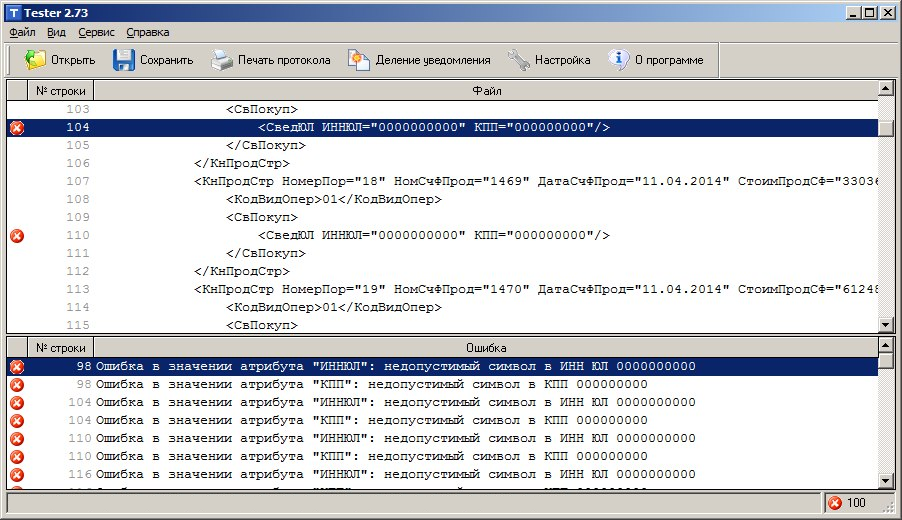
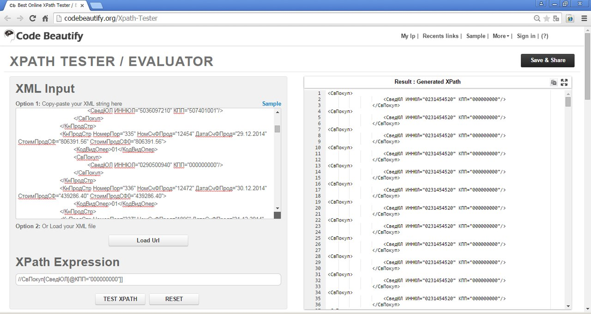
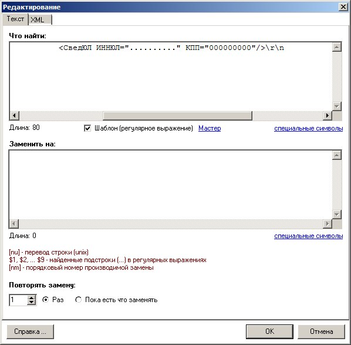
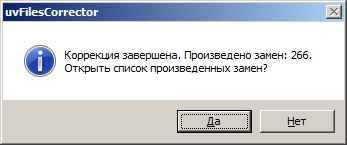
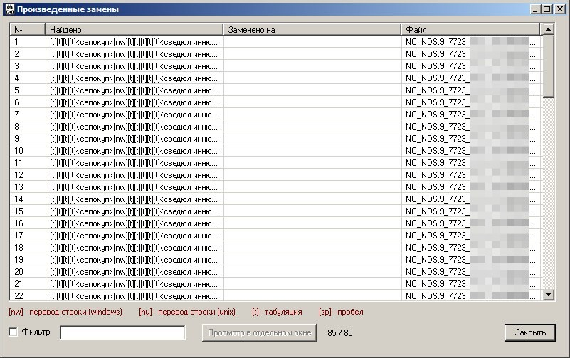

.. _xml-experience:

III. Практические примеры
===================================

В данной главе приведены некоторые практические приемы работы с XML-файлами.

Исправление невалидных XML-файлов
------------------------------------

Если по каким-то причинам между тегами оказывается символ ``<`` или лбой другой управляющий символ (подробнее смотрите :ref:`xml-valid`), то при синтаксическом анализе XML-файла возникнет ошибка «Невалидный XML».

Исправляется данная проблема просто — данные символы необходимо заменить на их сущности (подробнее смотрите раздел :ref:`essence`). Сделать это можно, воспользовавшись любым нормальным текстовым редактором с функцией поиска и замены с использованием *регулярных выражений*.

.. tip:: Подробнее о регулярных выражениях смотрите статью `Регулярные
   выражения <https://ru.wikipedia.org/wiki/%D0%A0%D0%B5%D0%B3%D1%83%D0%BB%D1%8F%D1%80%D0%BD%D1%8B%D0%B5_%D0%B2%D1%8B%D1%80%D0%B0%D0%B6%D0%B5%D0%BD%D0%B8%D1%8F>`__
   и книгу `Бен Форта: Освой самостоятельно регулярные выражения. 10
   минут на урок <http://rutracker.org/forum/viewtopic.php?t=3828631>`__

.. note:: Сообщение о невалидности XML-файла может возникать если после закрывающего родительского тега (см. раздел :ref:`parrent-tag`) находится еще какой-либо текст. В данном случае достаточно удалить все, что идет после закрывающего родительского тега.

Также можно воспользоваться скриптом ``xml_healer.py``, который автоматически заменяет управляющие символы на их сущности и удаляет лишние символы после закрывающего родительского тега. Подробная инструкция по работе со скриптом приведена в главе :ref:`xml-healer`.

Удаление лишних блоков(абзацев) из XML по заданному условию
-----------------------------------------------------------

Теги в структуре XML образуют многострочные блоки. Иногда возникает необходимость удалить ряд целых блоков по заданному условию. В качестве примера будет рассмотрена ситуация с отчетом по :abbr:`НДС (Налог на добавленную стоимость)`.

Для передачи налоговой отчетности по :abbr:`ТКС (Телекоммуникационные каналы связи)` в контролирующие органы используется XML. Весь учет ведется в одних программах (например, в 1С), затем выгружается из них в xml формате и отправляется по ТКС непосредственно в контролирующие органы.

Из-за несовершенства некоторых программ, периодически возникают проблемы при передаче файлов в контролирующие органы.

Суть проблемы
~~~~~~~~~~~~~

Согласно `приказу ФНС от 29 октября 2014 г. N ММВ-7-3/558@ <https://normativ.kontur.ru/document?from=extern&moduleId=1&documentId=244104>`__ в Книге продаж элемент ``<СвПокуп>`` (Сведения о покупателе, его ИНН/КПП) является необязательным, другими словами он может полностью отсутствовать.

Отрывок книги продаж выглядит следующим образом:

.. code-block:: xml

    <КнПродСтр НомерПор="134" НомСчФПрод="11444" ДатаСчФПрод="27.11.2014" СтоимПродСФ="397917.28" СтоимПродСФ0="397917.28">
        <КодВидОпер>01</КодВидОпер>
        <СвПокуп>
            <СведЮЛ ИННЮЛ="0190670940" КПП="000000000"/>
        </СвПокуп>
    </КнПродСтр>
    <КнПродСтр НомерПор="135" НомСчФПрод="2332838" ДатаСчФПрод="23.10.2014" СтоимПродСФ="6790000.00" СумНДССФ18="603389.90">
        <КодВидОпер>02</КодВидОпер>
        <СвПокуп>
            <СведЮЛ ИННЮЛ="7743596506" КПП="774301001"/>
        </СвПокуп>
    </КнПродСтр>

А нижеприведенный блок в Книге продаж необязателен:

.. code-block:: xml

    <СвПокуп>
            <СведЮЛ ИННЮЛ="7743596506" КПП="774301001"/>
    </СвПокуп>

Если есть сделки с иностранными контрагентами, у которых нет ИНН/КПП, следовательно, сведения о покупателе не заполняются. Но из-за логической ошибки в программе бухгалтерского учета, выгрузка сформированного отчета была невозможна, так как программа ошибочно требовала указать ИНН/КПП для всех контрагентов.

Чтобы обойти эту ошибку пришлось вместо ИНН указать регистрационный номер контрагента в стране регистрации, а вместо КПП указать девять нулей.

Но при попытке отравить выгруженный отчет в контролирующий орган, возникала обратная ошибка. Так как ИНН и КПП были фиктивными, то при проверке отчета не выполнялись контрольные соотношения.

.. index:: Tester

       Проверка файла отчета программой Tester

.. note:: ИНН и КПП это не произвольный набор чисел, они содержат определенные контрольные соотношения.

Теперь следовало вручную исправить XML файл отчета и удалить лишние блоки с фиктивными данными.

Решение проблемы
~~~~~~~~~~~~~~~~

Так как файл содержал свыше 15000 строк и большое количество сделок, надо было автоматизировать данный процесс.

.. index:: Xpath-Tester, Xpath

С помощью запроса Xpath и сервиса `Xpath-Tester <http://codebeautify.org/Xpath-Tester>`__  были найдены все сделки с иностранными контрагентами. Запрос имел
вид ``//СвПокуп[СведЮЛ[@КПП0"000000000"]]``. Получилось приличное количество сделок, свыше 200.

Надо было удалить порядка 700 строк, полностью содержащих блоки (причем
с разными псевдо-ИНН):

.. code-block:: xml

    <СвПокуп>
        <СведЮЛ ИННЮЛ="0291265150" КПП="000000000"/>
    </СвПокуп>

Большинство программ умеет искать и заменять максимум одну строку на
другую. В данном случае надо было искать и заменять блок текста из трех
строк. 

.. index:: UVFilesCorrector

С этим успешно справилась программа `UVFilesCorrector <http://www.uvsoftium.ru/uvFilesCorrector.php>`__. Интерфейс программы прост до невозможности. В нижней части на вкладке *Файлы* выбираем нужный нам файл.

.. figure:: img/xml-man-uv-003a.jpg
       :width: 400 px
       :align: center
       :alt:

В верхнем поле *Список замен* необходимо нажать на пустое поле и создаем правило для замены. В данном случае оно выглядело так:

На скриншоте видно не все выражение, в поле *Что найти:* в режиме
*Шаблон (регулярное выражение)* введено:

.. code-block:: xml

     <СвПокуп>\r\n
         <СведЮЛ ИННЮЛ=".........." КПП="000000000"/>\r\n
      </СвПокуп>

.. tip:: Подробнее о регулярных выражениях смотрите статью `Регулярные
   выражения <https://ru.wikipedia.org/wiki/%D0%A0%D0%B5%D0%B3%D1%83%D0%BB%D1%8F%D1%80%D0%BD%D1%8B%D0%B5_%D0%B2%D1%8B%D1%80%D0%B0%D0%B6%D0%B5%D0%BD%D0%B8%D1%8F>`__
   и книгу `Бен Форта: Освой самостоятельно регулярные выражения. 10
   минут на урок <http://rutracker.org/forum/viewtopic.php?t=3828631>`__

Десять точек в ``ИННЮЛ=".........."`` являются *регулярным выражением*  и означают, что на их месте может стоять любой символ. В итоге получилось, что под замену попадали все блоки, имеющие нулевые КПП. Комбинация символов ``\r\n`` также является регулярным выражением и означает перенос строки.

Всего у организации было 14 контрагентов, с которыми в общей сумме было
заключено 266 сделок. Следовательно, после нажатия на кнопку *Заменить*
получилось 266 замены.

Буквально за один простой шаг по заданному условию было удалено свыше
700 строк. Проверка Tester’ом  ошибок не выявила и файл был успешно отправлен в контролирующий орган.
