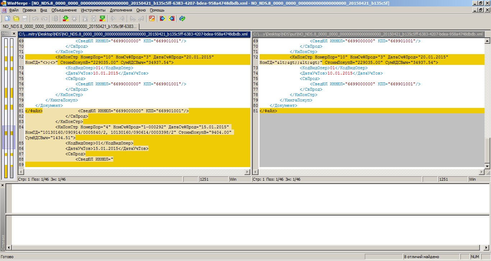
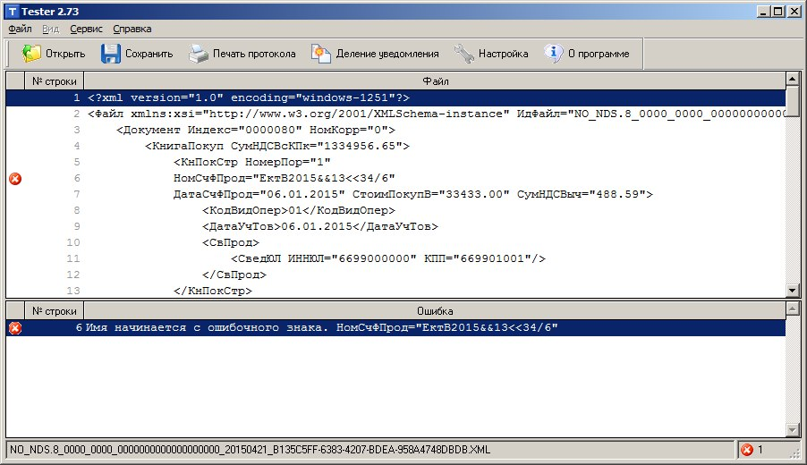
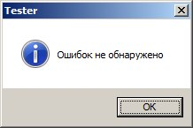

.. _xml-healer:

IV. Скрипт для замены служебных символов в XML
===============================================

.. index:: xml_healer.py

Описание
-----------

``xml_healer.py`` (*англ.* healer — целитель) — скрипт для массового исправления невалидных XML файлов.

Скрипт выполняет следующие замены:

* Символ ``&`` заменяется на ``&amp;``;
* Символ ``<`` заменяется на ``'&lt;``;
* Символ ``>`` заменяется на ``&gt;``
* Символы ``«»`` заменяются на ``&quot;``

Также скрипт удаляет все, что идет после закрывающего родительского тега ``<\Файл>``.

Системные требования
~~~~~~~~~~~~~~~~~~~~

Для работы скрипта необходимо установить интерпретатор языка программирования Python (https://www.python.org/downloads/) версии 3 или выше.

Авторские права
~~~~~~~~~~~~~~~

Скрипт xml_healer.py распространяется на условиях лицензии `«Attribution-ShareAlike» («Атрибуция — На тех же условиях») 4.0 Всемирная <https://creativecommons.org/licenses/by-sa/4.0/deed.ru>`_.

------

Порядок работы
--------------

#. Поместить скрипт ``xml_healer.py`` в папку с XML файлами отчетов;
#. Запустить скрипт двойным нажатием и дождаться завершения его работы;
#. Ещё раз прогнать исправленный XML файл через `Tester <http://www.nalog.ru/rn77/program/all/tester/>`_.

После завершения обработки файлов в командной строке будет выведена информация о результате обработки и сообщение «*Нажмите Enter*». Обработанные файлы будут находиться в папке ``out``. Оригинальные файлы останутся нетронутыми в текущей директории.

Выводимая информация
~~~~~~~~~~~~~~~~~~~~

В ходе выполнения скрипта выводится несколько типов сообщений:

.. code-block:: bash

    Имя файла: NO_NDS.9_0000_0000_00000000000000000000_20150427_80c4e37b-a160-4b2f-827c-69226f792dfd.xml
    Исцелен!

Сообщение ``Исцелен!`` означает, что файл успешно обработан и его исправленная копия находится в папке ``out``.

.. code-block:: bash

    Имя файла: ФАЙЛ.odt
    Не является XML-файлом

Сообщение ``Не является XML-файлом`` означает, что файл не является файлом отчета. ``xml_healer.py`` сканирует все файлы в папке, в которой находится и обрабатывает только те файлы, в конце которых стоит расширение ``.xml``.

.. code-block:: bash

    Имя файла: file.xml
    Файл имеет кодировку отличную от windows-1251

Сообщение появляется, если XML файл имеет кодировку отличную от ``windows-1251``. Возможно, данный XML файл не является файлом отчета, так как файлы отчетов должны иметь кодировку ``windows-1251``.

Рекомендации
~~~~~~~~~~~~~~~~~~~~~~~~

После работы скрипта рекомендуется прогнать XML файлы через `Tester <http://www.nalog.ru/rn77/program/all/tester/>`_. При проверке невалидного XML файла Tester, натыкаясь на первый же некорректный символ, прекращает проверку. ``xml_healer.py`` исправляет все некорректные символы и Tester может осуществить полную проверку файла, в ходе которой могут обнаружиться ошибки уже не в структуре файла, а в самом содержимом.

-------

Проверка изменений в файлах
---------------------------

Чтобы проверить и сравнить изменения в XML файлах, необходимо воспользоваться программой `WinMerge <http://winmerge.org/about/?lang=ru>`_.

   Слева —  исходный файл. Справа — файл после обработки скриптом ``xml_healer.py``

---------

Программное обеспечение
-----------------------

* `xml_healer.py <https://github.com/mazhartsev/xml_healer.py/archive/master.zip>`_
* `Python 3 <https://www.python.org/downloads/>`_
* `Tester <http://www.nalog.ru/rn77/program/all/tester/>`_
* `WinMerge <http://winmerge.org/about/?lang=ru>`_

Приложение
-----------

Процесс работы скрипта ``xml_healer.py`` со скриншотами:

   Шаг 0 — Прогон файла через Tester 

.. figure:: img/xml_healer_screen-001.png
   :width: 400 px
   :align: center
   :alt: Шаг 1 — Поместить скрипт с файлами для обработки
   
   Шаг 1 — Поместить скрипт с файлами для обработки и дойным нажатием запустить скрипт.

.. figure:: img/xml_healer_screen-002.png
   :width: 400 px
   :align: center
   :alt: Шаг 2 — Во время работы скрипта откроется окно командной строки, в котором будет выведен результат обработки файлов.
   
   Шаг 2 — Во время работы скрипта откроется окно командной строки, в котором будет выведен результат обработки файлов.

.. figure:: img/xml_healer_screen-003.png
   :width: 400 px
   :align: center
   :alt: Шаг 3 — Обработанные файлы будут находиться в папке out
   
   Шаг 3 — Обработанные файлы будут находиться в папке ``out``.

   Шаг 4 — Повторный прогон исправленного файла через Tester
