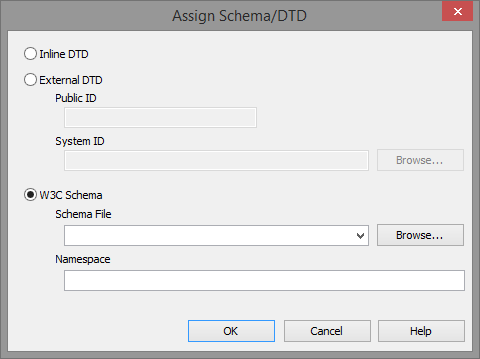
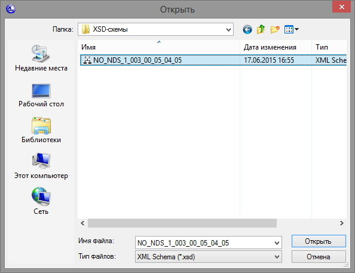
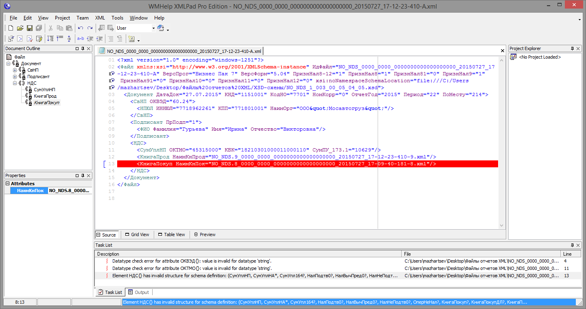
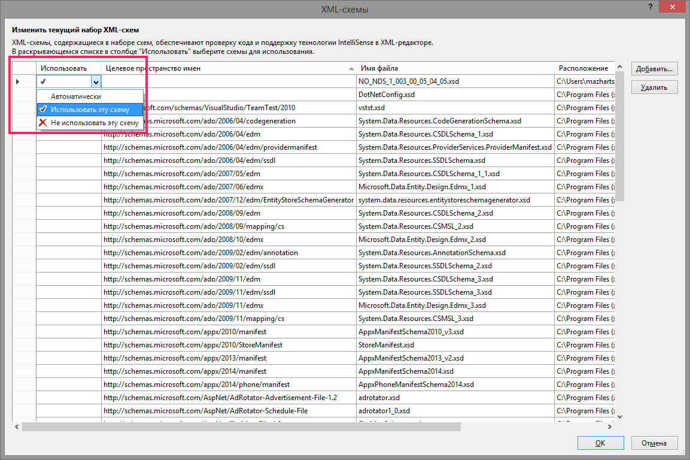

.. _xsd:

V. Проверка XML-файла по XSD-схеме
=======================================================

В данном разделе описаны способы проверки  XML-файла по XSD-схеме. Сделать это можно разными способами, существует много программ  для этих целей. По XSD-схеме, например, проверяет программа `Tester <http://www.nalog.ru/rn77/program/all/tester/>`__, но она только показывает ошибки и не дает их исправить. Для большего удобства лучше использовать специализированные редакторы такие, как XMLPad или MS Visual Studio.

.. tip:: Проверять файл по XSD-схеме целесообрано в исключительных случаях, например, если скрипт ``xml-healer.py`` не справился с исправлением файла. Подробнее в главе :ref:`xml-healer`.

**MS Visual Studio** является спецаилизированным инструментом для программистов, обладающим огромным функционалом. Работа с XML и автоматическая проверка по XSD -- лишь одна из множества функций среды разработки. MS Visual Studio 15 можно скачать бесплатно с официального сайта: https://www.visualstudio.com/ru-ru/products/visual-studio-community-vs.

**XMLPad** — многофункциональный специализированный XML редактор. XMLPad обладает богатым функционалом, поддерживает XPath, возможность удалять целые блоки тегов, смену кодировок, проверку валидности и т.д. XMLPad доступен для бесплатного использования на сайте: http://xmlpad-mobile.com.

.. tip:: XMLPad уступает по удобству и возможностям MS Visual Studio, но если вы не являетесь программистом и у вас не установлена MS Visual Studio, лучше воспользоваться XMLPad.

.. note:: Перед проверкой файлов необходимо предварительно скачать файлы XSD-схем. Скачать XSD-схемы можно с официальных сайтов контролирующих органов. В качестве примера взята декларация по НДС, скачать XSD-схему для нее можно с сайта `Справочник налоговой и бухгалтерской отчетности <http://format.nalog.ru/>`__.

Проверка по XSD-схеме в XMLPad
--------------------------------------------------------

1. Откройте XML-файл, который требуется проверить в XMLPad *File > Open*.

.. figure:: img/xsd/xml-validate-001.png
       :width: 400 px
       :align: center
       :alt:

2. Чтобы проверить файл по заданной XSD-схеме, его надо с ней ассоциировать. Перейдите в меню *XML > Assign Schema/DTD*.

.. figure:: img/xsd/xml-validate-002a.png
       :width: 400 px
       :align: center
       :alt:

3. Выберите *W3C Schema* и нажмите *Browse*, затем выберите XSD-схему для проверки. 

4. После того, как XSD-схема ассоциирована, нажмите ``F7`` или *XML > Validate*, чтобы проверить файл. В нижней части окна будут выведены ошибки, нажав на которые можно подсветить строку, в которой они находятся.

	   
	   
.. tip:: Для удобства отображения можно включить переносы строк *Edit > Word Wrap*.
	   
	   
Проверка по XSD-схеме в MS Visual Studio
--------------------------------------------------------   

1. Откройте XML-файл, который требуется проверить в MS Visual Studio *Файл > Открыть > Файл*.

.. figure:: img/xsd/ms-vstudio-001.png
       :width: 400 px
       :align: center
       :alt:

2. Чтобы проверить файл по заданной XSD-схеме, его надо с ней ассоциировать. Перейдите в меню *XML-код > Схемы...*.

.. figure:: img/xsd/ms-vstudio-002.png
       :width: 300 px
       :align: center
       :alt:

3. Нажмите *Добавить* и выберите файл XSD-схемы. 

	   

Проверка на соответсвие XSD-схеме будет осуществляться автоматически на лету. Внизу в окне *Списка ошибок* будет отображаться список ошибок. При нажатии на ошибку, она будет подсвечена в редакторе.

.. tip:: Добавить окно *Списка ошибок* можно через *Вид > Списка ошибок*.

 
	   